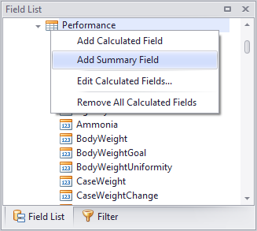
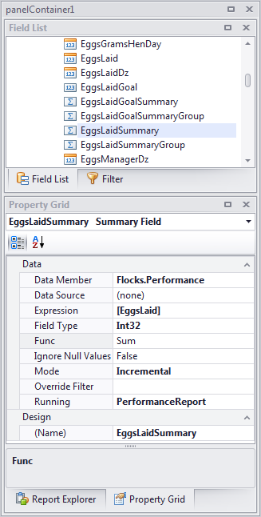

   

I'm interested in feedback! Let me know what your needs are on [gitter](https://gitter.im/jnm2/DevExpressMods?utm_source=badge&utm_medium=badge&utm_campaign=pr-badge&utm_content=badge) or [start a specific issue](https://github.com/jnm2/DevExpressMods/issues).

About
=====
This project is a temporary stopgap for DevExpress's lack of support for complex summary calculations, seen here:
[https://www.devexpress.com/support/center/Question/Details/S133081](https://www.devexpress.com/support/center/Question/Details/S133081)

If DevExpress produces a solution in the future that covers all these use cases, this solution will be deprecated.

This project is under the MIT license to maximize your freedom. See [LICENSE.txt](https://github.com/jnm2/DevExpressMods/blob/master/LICENSE.txt).

Getting Started
===============
ModdedEndUserDesigner.cs shows how to use the feature.
If you build this project and reference it in your software, you can drag ModdedEndUserDesigner from the toolbox instead of XRDesignMdiController.
Or you can call `SummaryFieldsFeature.Apply` directly, if that is easier.

This will give you a new menu option in your end user designer fields list in window.
Right click and select Add Summary Field (directly under Add Calculated Field):

(End user designer only. While summary fields should run just as well in the Visual Studio designer as in the end user designer, we didn't create an extension to modify the Visual Studio field menu. My company wouldn't use it anyway; we use the EUD to design and deploy our customers' reports. If someone has the desire to look into this, a pull request would be awesome.)

Documentation
=============
The power of a summary field is that it *is* a calculated field. Internally, the summary field inherits from calculated field and extends it. This means you can use a summary field's value in another calculated field's expression or another summary field's expression.

Whereas a regular calculated field operates only on the current row, the summary field can operate in one of two modes:

 1. Immediate mode, in which it calculates a summary on all rows in the data table (with an optional filter).
    The summary value remains the same for each row in the data table. Each data row is considered, whether printed on the report or not.
    This mode is most useful when used as part of a bigger calculation.
    For example, add a summary field named `SalesTotal` with the expression `[Sales]` and summary function Sum.
    Then add a second field, a normal per-row calculated field named `PercentOfTotal`, with the expression `[Sales] * 100 / [SalesTotal]`.

 2. Incremental mode, in which it calculates a summary for each row from the top row of the table to the current row.
    Useful for running totals. In this mode you also can reset the summary at any group band (`Running` property), not just the most immediate parent group.
    Reset can even be disabled so that it continues accumulating to the end of the report regardless of groups.

There is no limit to the amount of chaining that can be done between summary fields and calculated fields.
Summary fields can summarize other summary fields, other calculated fields, data fields from the current table, or any valid expression combining any of these.

You are limited only by your imagination.

Support
=======
This project is taken from code that has been in production for over a year with minor tweaks along the way.
I wouldn't release it if it wasn't reliable; however it's possible that I overlooked a use case, so verify your reports carefully.

If you find a bug, please report it via https://github.com/jnm2/DevExpressMods/issues. I will likely have it fixed in a day or two.

If you are confused about how the feature works, feel free to ask via [Gitter](https://gitter.im/jnm2/DevExpressMods) or the [issues](https://github.com/jnm2/DevExpressMods/issues) page. I'll update the documentation as needed.
